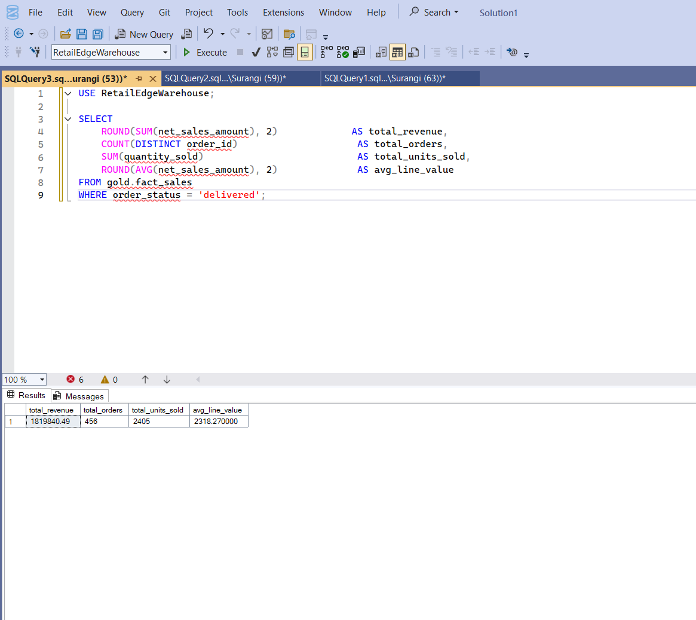
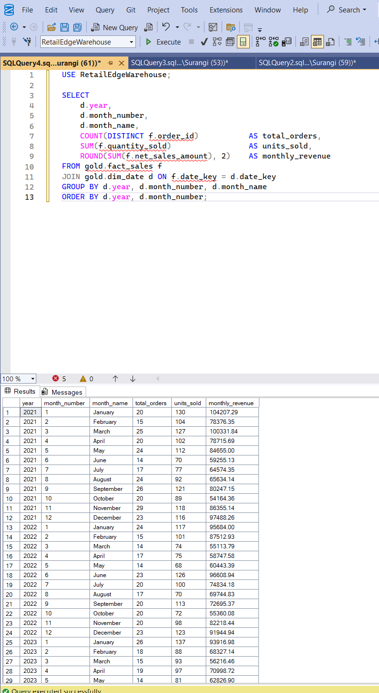
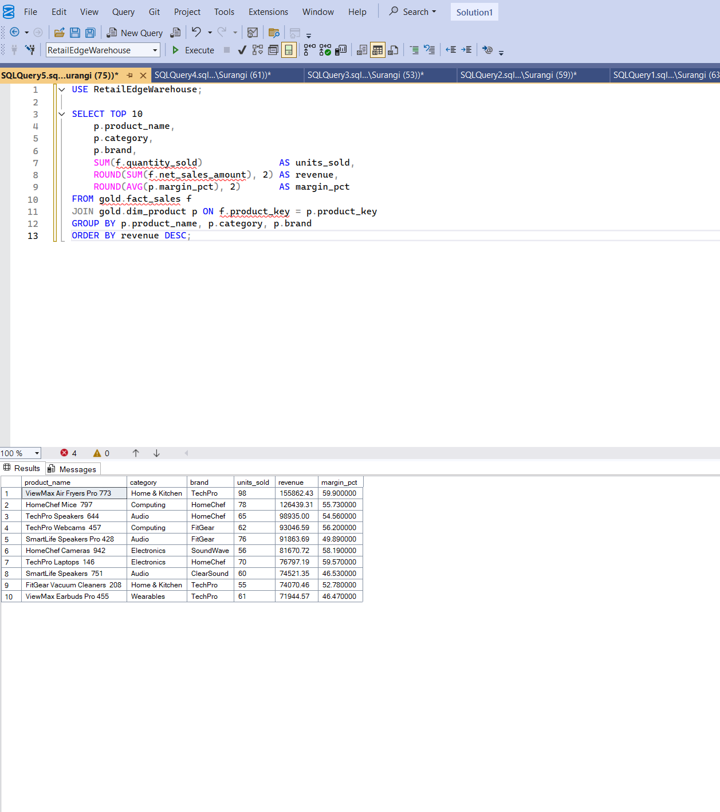
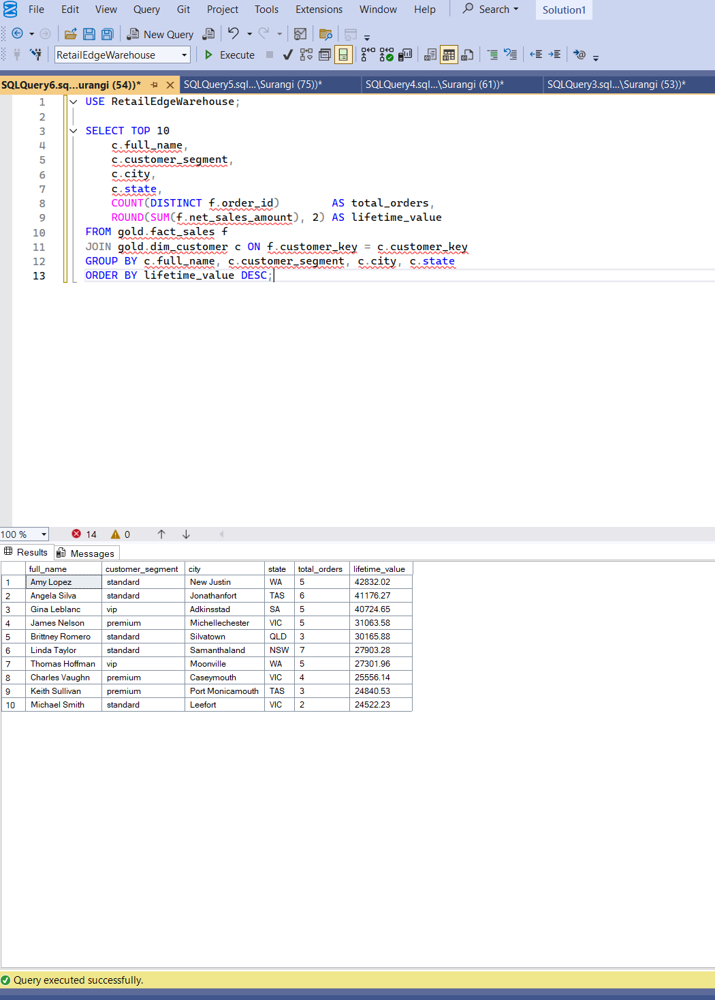
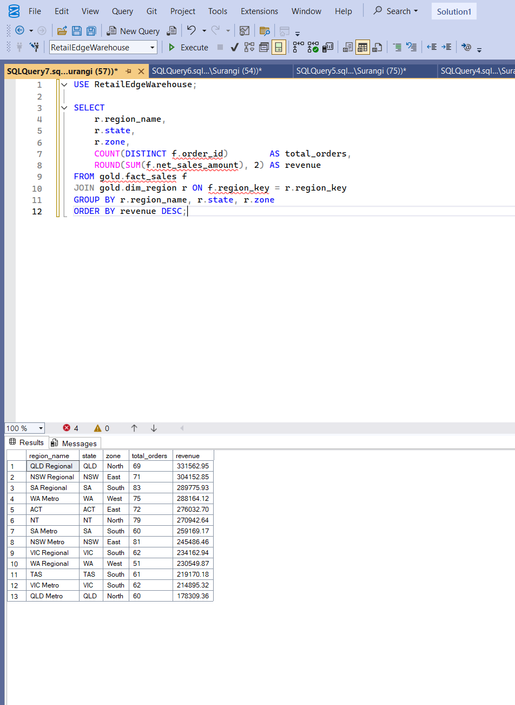
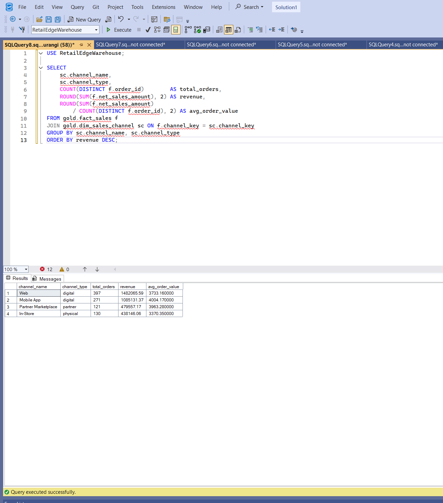
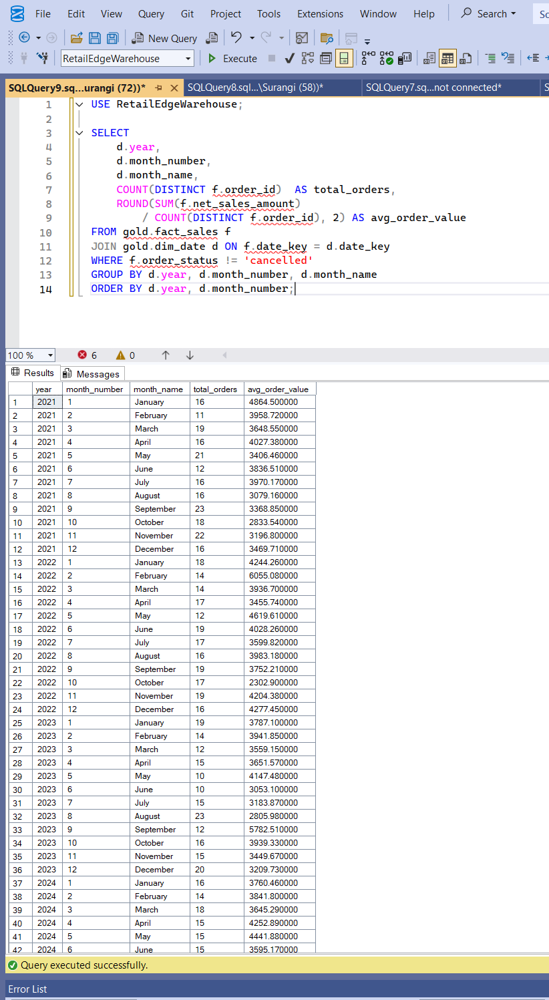
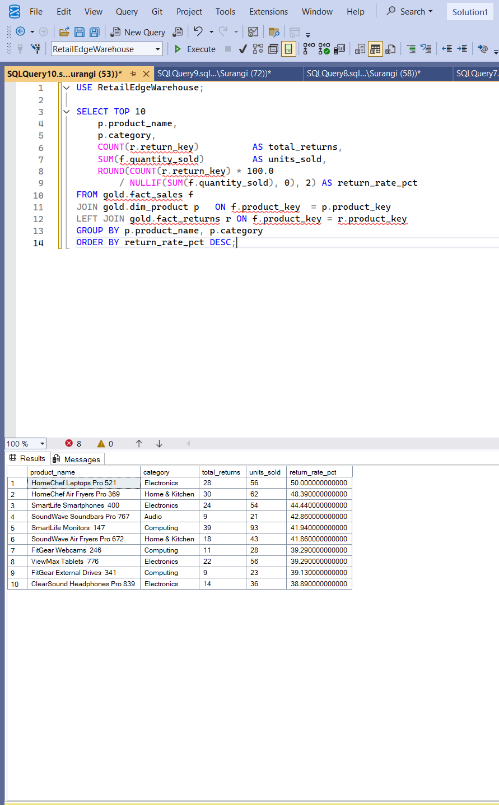
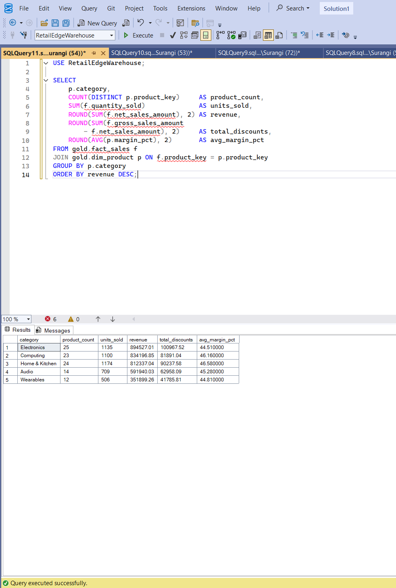
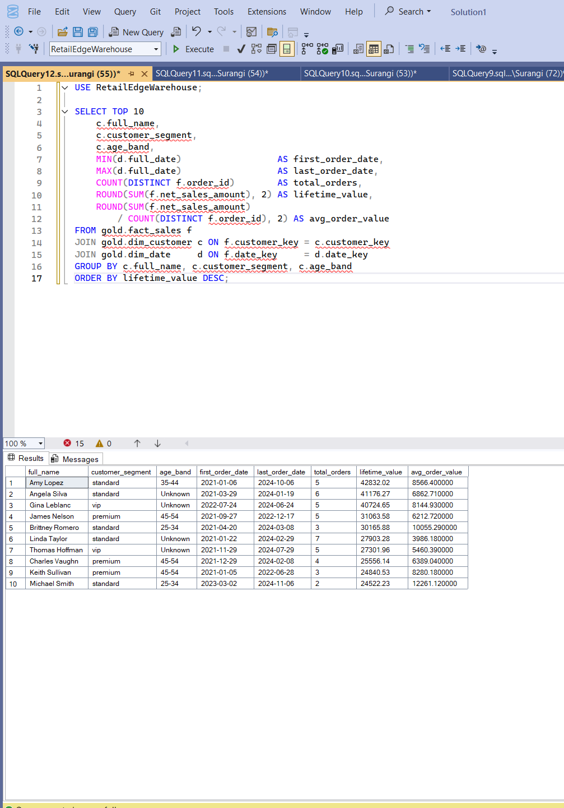

# 🏪 RetailEdge Analytics: SQL Data Warehouse

> **Bronze · Silver · Gold Medallion Architecture**
> SQL Server · PostgreSQL · Power BI · GitHub


---

## 📌 Project Overview

This project builds a **production-style SQL data warehouse** for a fictional Australian retail and e-commerce company called **RetailEdge Pty Ltd**.

Raw sales data from four disconnected business systems is ingested, cleaned, transformed, and modelled into a **star schema** ready for Power BI reporting — following the industry-standard **Bronze → Silver → Gold medallion architecture**.

> 💡 This is my **second portfolio project**, complementing my [NDIS Power BI Dashboard](https://github.com/surangisns/ndis-powerbi-dashboard) by showing the **data engineering layer that sits behind any analytics dashboard**.

---

## 🎯 Business Problem

RetailEdge has sales data spread across four systems:

| System | Data |
|--------|------|
| E-commerce Platform | Orders and order line items |
| CRM | Customer master records |
| ERP | Products and regions |
| Returns Portal | Product returns and refunds |

Analysts cannot answer basic questions like:
- Which products are driving the most revenue?
- Which customer segments are most valuable?
- How do sales differ by region and sales channel?
- What is the product return rate by category?
- What does the monthly revenue trend look like?

**This data warehouse solves that** by consolidating, cleaning, and modelling all data into a single trusted source of truth.

---

## 🏗️ Architecture

```
┌─────────────────────────────────────────────────┐
│              SOURCE SYSTEMS                     │
│   CRM · ERP · E-commerce · Returns Portal      │
└────────────────────┬────────────────────────────┘
                     │  CSV Export
                     ▼
┌─────────────────────────────────────────────────┐
│           BRONZE LAYER  (schema: bronze)        │
│  Raw ingestion — data loaded as-is from CSV     │
│  No transformations · Preserves source issues   │
└────────────────────┬────────────────────────────┘
                     │  SQL Transform + Clean
                     ▼
┌─────────────────────────────────────────────────┐
│           SILVER LAYER  (schema: silver)        │
│  Cleaned · Standardised · Deduplicated          │
│  Dates normalised · Nulls handled · DQ checked  │
└────────────────────┬────────────────────────────┘
                     │  Dimensional Modelling
                     ▼
┌─────────────────────────────────────────────────┐
│           GOLD LAYER  (schema: gold)            │
│  Star Schema · Dimensions + Facts               │
│  Optimised for Power BI and analytics queries   │
└────────────────────┬────────────────────────────┘
                     │
                     ▼
            📊 Power BI Dashboard
```

---

## 🛠️ Tech Stack

| Tool | Purpose |
|------|---------|
| **SQL Server 2019** | Primary database and ETL engine |
| **PostgreSQL 15** | Alternative database scripts provided |
| **Excel / CSV** | Source data format |
| **Power BI Desktop** | Dashboard and reporting layer |
| **GitHub** | Version control and portfolio showcase |

---

## 📂 Repository Structure

```
retailedge-sql-datawarehouse/
│
├── 📁 datasets/                    ← 8 raw CSV source files
│   ├── customers.csv               (500 rows)
│   ├── products.csv                (98 rows)
│   ├── orders.csv                  (2,000 rows)
│   ├── order_items.csv             (3,444 rows)
│   ├── returns.csv                 (300 rows)
│   ├── regions.csv                 (20 rows)
│   ├── sales_channels.csv          (8 rows)
│   └── promotions.csv              (15 rows)
│
├── 📁 sql_server/                  ← SQL Server scripts (T-SQL)
│   ├── 01_create_database.sql
│   ├── 02_create_schemas.sql
│   ├── 03_bronze_tables.sql
│   ├── 04_load_csv_data.sql
│   ├── 05_silver_tables.sql
│   ├── 06_bronze_to_silver.sql
│   ├── 07_gold_dimensions.sql
│   ├── 08_gold_facts.sql
│   └── 09_create_indexes.sql
│
├── 📁 postgresql/                  ← PostgreSQL scripts
│   ├── 01_create_database.sql
│   ├── 02_create_schemas.sql
│   ├── 03_bronze_tables.sql
│   ├── 04_load_csv_data.sql
│   ├── 05_silver_tables.sql
│   ├── 06_bronze_to_silver.sql
│   ├── 07_gold_dimensions.sql
│   ├── 08_gold_facts.sql
│   └── 09_create_indexes.sql
│
├── 📁 data_quality/                ← DQ validation scripts
│   ├── dq_null_checks.sql
│   ├── dq_duplicate_checks.sql
│   ├── dq_referential_integrity.sql
│   ├── dq_date_validation.sql
│   └── dq_reconciliation.sql
│
├── 📁 analytics/                   ← Business analytics queries
│   ├── revenue_analysis.sql
│   ├── customer_analysis.sql
│   ├── product_analysis.sql
│   ├── regional_analysis.sql
│   └── channel_analysis.sql
│
├── 📁 powerbi/
│   └── retailedge_dashboard.pbix
│
├── 📁 docs/
│   ├── architecture_diagram.png
│   ├── star_schema_diagram.png
│   └── data_dictionary.md
│
├── 📁 screenshots/
│   └── (Power BI dashboard screenshots)
│
└── 📄 README.md
```

---

## 📊 Dataset Description

| File | Rows | Description | Key Data Quality Issues |
|------|------|-------------|------------------------|
| `customers.csv` | 500 | Customer master from CRM | Duplicate emails, mixed date formats, inconsistent gender codes |
| `products.csv` | 98 | Product catalogue from ERP | Negative unit costs, inconsistent active flags |
| `orders.csv` | 2,000 | Order headers from e-commerce | Delivery before shipping, null region IDs, orphaned customer IDs |
| `order_items.csv` | 3,444 | Order line items | Negative quantities, line total mismatches, null product IDs |
| `returns.csv` | 300 | Returns and refunds | Return before order date, refund exceeding sale price |
| `regions.csv` | 20 | Geographic region reference | Duplicate names, inconsistent country spelling |
| `sales_channels.csv` | 8 | Sales channel reference | Duplicate names, commission > 100% |
| `promotions.csv` | 15 | Discount campaigns | End date before start date, mixed date formats |

> All data quality issues are intentional and realistic — they are resolved in the Silver layer transformation scripts.

---

## ⚙️ ETL Process

### Bronze Layer — Raw Ingestion
- CSV files loaded as-is using `BULK INSERT` (SQL Server) or `\COPY` (PostgreSQL)
- No transformation — data is preserved exactly as received
- `dwh_load_ts` timestamp added to track when each row was loaded

### Silver Layer — Clean & Standardise
- **Deduplication** using `ROW_NUMBER() OVER (PARTITION BY ...)`
- **Date normalisation** — mixed formats (DD/MM/YYYY, MM/DD/YYYY, YYYY-MM-DD) converted to standard `DATE`
- **Gender standardisation** — M/Male/m/Female/F → Male/Female/Other
- **Active flag normalisation** — Y/N/1/0/yes/no → consistent boolean
- **Null handling** — defaults applied, invalid nulls flagged
- **Referential integrity** — orphaned records identified and excluded

### Gold Layer — Dimensional Model
- **Surrogate keys** added to all dimension tables (`BIGSERIAL` / `IDENTITY`)
- **dim_date** pre-populated as a full date spine (2020–2030)
- **Age band** derived in `dim_customer` from date of birth
- **fact_sales** built by joining Silver order + order_items with all dimension keys
- **fact_returns** linked back to fact_sales via order and product keys

---

## ⭐ Star Schema

```
                    dim_date
                       │
        dim_region ────┤
                       │
dim_sales_channel ─────┼──── fact_sales ──── dim_customer
                       │
        dim_product ───┤
                       │
                    fact_returns
```

### Dimension Tables

| Table | Grain | Key Columns |
|-------|-------|-------------|
| `dim_customer` | One row per customer | customer_key, customer_id, full_name, segment, age_band |
| `dim_product` | One row per product | product_key, product_id, name, category, subcategory, brand |
| `dim_date` | One row per calendar day | date_key (YYYYMMDD), year, quarter, month, week, day |
| `dim_region` | One row per region | region_key, region_id, region_name, state, country, zone |
| `dim_sales_channel` | One row per channel | channel_key, channel_id, channel_name, channel_type |

### Fact Tables

| Table | Grain | Measures |
|-------|-------|---------|
| `fact_sales` | One row per order line item | quantity_sold, unit_price, discount_amount, gross_sales_amount, net_sales_amount |
| `fact_returns` | One row per return event | refund_amount, return_reason, return_status |

---

## ✅ Data Quality Checks

Validation scripts are run after each layer:

| Check | Script |
|-------|--------|
| Duplicate records | `dq_duplicate_checks.sql` |
| Null values on critical columns | `dq_null_checks.sql` |
| Invalid date ranges (delivery before shipping, return before order) | `dq_date_validation.sql` |
| Negative amounts and quantities | `dq_null_checks.sql` |
| Missing foreign keys (referential integrity) | `dq_referential_integrity.sql` |
| Row count reconciliation Bronze vs Silver | `dq_reconciliation.sql` |
| Sales total reconciliation | `dq_reconciliation.sql` |

---

## 📈 Analytics Queries

10 business analytics queries built on the Gold layer:

| # | Query | File |
|---|-------|------|
| 1 | Total revenue | `revenue_analysis.sql` |
| 2 | Monthly sales trend | `revenue_analysis.sql` |
| 3 | Top 10 products by revenue | `product_analysis.sql` |
| 4 | Top 10 customers by lifetime value | `customer_analysis.sql` |
| 5 | Sales by region | `regional_analysis.sql` |
| 6 | Sales by channel | `channel_analysis.sql` |
| 7 | Average order value (AOV) by month | `revenue_analysis.sql` |
| 8 | Product return rate | `product_analysis.sql` |
| 9 | Product category performance | `product_analysis.sql` |
| 10 | Customer lifetime value (CLV) | `customer_analysis.sql` |

---

## 📊 Power BI Dashboard

Power BI Desktop connects directly to the **Gold layer** in SQL Server or PostgreSQL.

**Report Pages:**

| Page | Title | Key Visuals |
|------|-------|-------------|
| 1 | Executive Sales Overview | Revenue KPI, monthly trend, top 5 products |
| 2 | Customer Analytics | Segment breakdown, top customers, CLV |
| 3 | Product & Category Performance | Revenue by category, return rate |
| 4 | Regional Sales Performance | Sales map, state drilldown, regional trends |

---

## 📸 Analytics Query Results

### Total Revenue


### Monthly Sales Trend


### Top Products by Revenue


### Top Customers


### Sales by Region


### Sales by Channel


### Average Order Value


### Product Return Rate


### Category Performance


### Customer Lifetime Value



## 💡 Key Learnings

- Designing a **medallion architecture** (Bronze/Silver/Gold) from scratch
- **Dimensional modelling** — facts, dimensions, surrogate keys, date spines
- Writing **SQL ETL transformations** for real-world messy data
- Building **data quality checks** as part of the pipeline
- Understanding **why star schemas** exist and how Power BI uses them
- Managing a **structured SQL project on GitHub**

---

## 🚀 Future Improvements

- [ ] Automate ETL pipeline using Python scripts
- [ ] Add Slowly Changing Dimension (SCD Type 2) for dim_customer
- [ ] Add incremental load logic instead of full refresh
- [ ] Build a data quality dashboard in Power BI
- [ ] Add unit tests for SQL transformations

---

## 👤 Author

**Surangani Bandara**
Data Analyst | Power BI | SQL | Python

🔗 [GitHub Profile](https://github.com/surangisns)
🔗 [First Portfolio Project — NDIS Power BI Dashboard](https://github.com/surangisns/ndis-powerbi-dashboard)

---

*This project was built as part of a data analytics portfolio to demonstrate SQL data engineering, dimensional modelling, and ETL design skills.*
